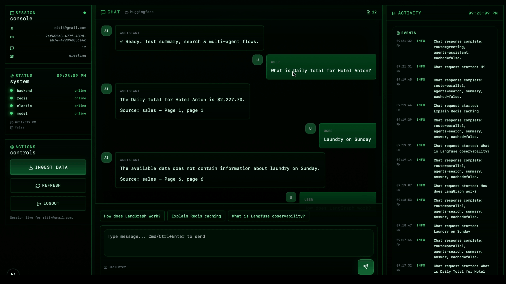
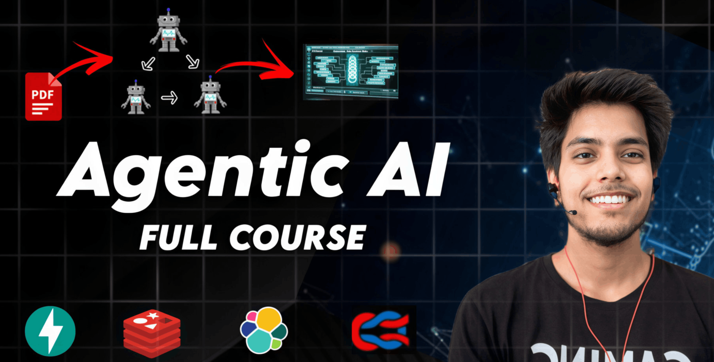

# Agentic AI Chat System

**A multi-agent AI chat system that actually works**

## What's This?

An AI chat system with multiple agents working together - one supervises, one searches, and one summarizes. Upload documents, ask questions, and get intelligent responses. Simple as that.

## Tech Stack

**Backend**
- FastAPI
- LangChain
- Redis
- Elasticsearch
- HuggingFace Models

**Frontend**
- Next.js 15
- TypeScript
- Tailwind CSS

## Getting Started

1. Copy `.env.example` files and add your API keys
2. Run `podman-compose up -d` to start Redis & Elasticsearch
3. Start backend: `cd backend && pip install -r requirements.txt && uvicorn app.main:app --reload`
4. Start frontend: `cd frontend && npm install && npm run dev`
5. Open `http://localhost:3000`

That's it.

---

### Enjoying this project?

**⭐ Star this repo if you found it useful!**

